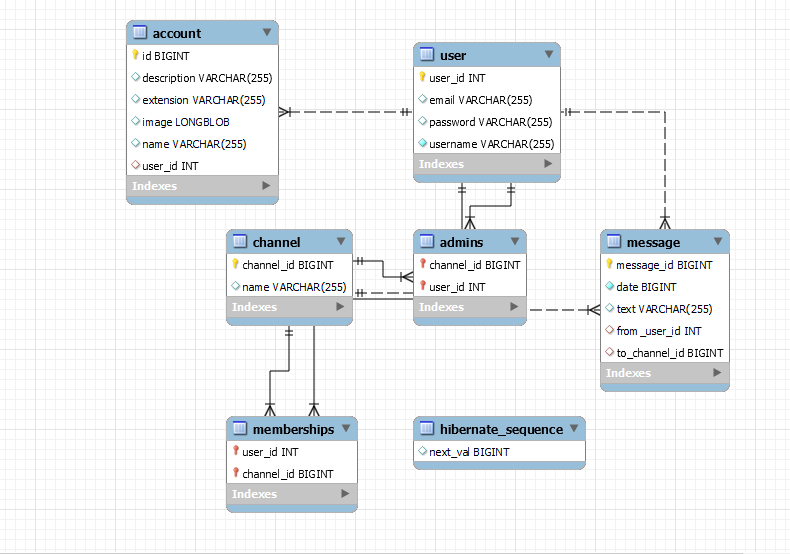

# Documentație - Chat application
## Mihai Rareș Daniel

---

## Specificația sistemului
Aplicația este o platformă web de socializare cu mesagerie instantă.

Utilizatorii pot să își facă un profil și să comunice folosind grupuri sau mesaje directe. Orice utilizator poate să creeze, să editeze si să steargă grupurile pe care le administrează, sau sa trimită mesaje altor utilizatori al căror pseudonim le este cunoscut.

Sistemul este organizat sub forma unei arhitecturi client - server. Clienții vor accesa aplicația din browser.

---

## Precizări tehnice
Java este un limbaj de programare popular, independent de platformă, care favorizează modularitatea și reutilizarea. Din aceste motive, Java a fost alegerea mea pentru programarea back-endului.

Pentru a reduce timpul necesar dezvoltării și pentru a crește productivitatea, am ales să folosesc Spring Boot.

Interfața grafică este realizată în HTML/CSS și Angular.

---

## Arhitectura sistemului
Sistemul este structurat folosind o arhitectură client - server.

Clasele serverului sunt organizate folosind șablonul arhitectural Layered.

Astfel, se remarcă 3 componente principale: Business, Domain și Persistence.

Baza de date folosită este MySql.

# Tabelele bazei de date

## Tabela "User"

### Descriere
Tabela "User" conține informații despre utilizatorii aplicației.

### Coloane
- `user_id` - identificator unic pentru fiecare utilizator; tipul de date este `int`;
- `username` - numele de utilizator al fiecărui utilizator; tipul de date este `String`;
- `email` - adresa de email a fiecărui utilizator; tipul de date este `String`;
- `password` - parola fiecărui utilizator; tipul de date este `String`.

### Relații
- Mulți la mulți între tabela "User" și tabela "Channel" prin intermediul tabelei "Memberships". Această relație permite unui utilizator să fie membru al mai multor canale și un canal să aibă mai mulți membri.

## Tabela "Channel"

### Descriere
Tabela "Channel" conține informații despre canalele din aplicație.

### Coloane
- `channel_id` - identificator unic pentru fiecare canal; tipul de date este `long`;
- `name` - numele fiecărui canal; tipul de date este `String`.

### Relații
- Mulți la mulți între tabela "Channel" și tabela "User" prin intermediul tabelei "Memberships". Această relație permite unui canal să aibă mai mulți membri și un utilizator să fie membru al mai multor canale.
- Mulți la mulți între tabela "Channel" și tabela "User" prin intermediul tabelei "Admins". Această relație permite unui canal să aibă mai mulți administratori.

## Tabela "Message"

### Descriere
Tabela "Message" conține informații despre mesajele din aplicație.

### Coloane
- `message_id` - identificator unic pentru fiecare mesaj; tipul de date este `long`;
- `text` - textul fiecărui mesaj; tipul de date este `String`;
- `date` - data și ora la care a fost trimis mesajul; tipul de date este `long`.

### Relații
- Unu la mulți între tabela "Message" și tabela "User" prin intermediul coloanei "from". Această relație indică utilizatorul care a trimis mesajul.
- Unu la mulți între tabela "Message" și tabela "Channel" prin intermediul coloanei "to". Această relație indică canalul către care a fost trimis mesajul.

## Tabela "Account"

### Descriere
Tabela "Account" conține informații despre conturile utilizatorilor.

### Coloane
- `id` - identificator unic pentru fiecare cont; tipul de date este `Long`;
- `user_id` - identificatorul unic al utilizatorului asociat acestui cont; tipul de date este `Long`;
- `image` - imaginea de profil a utilizatorului; tipul de date este `byte[]`;
- `name` - numele fișierului de imagine de profil; tip

## Endpoint-uri

Aici sunt listate toate endpoint-urile disponibile în aplicație, împreună cu o scurtă descriere și parametrii necesari pentru fiecare. Toate endpoint-urile trebuie apelate folosind metoda HTTP corectă (GET, POST, PUT, DELETE, etc.) și un header de tipul `Content-Type: application/json` pentru a specifica formatul datelor trimise și primite (în cazul în care este necesar).

## Endpoint-uri API pentru managementul contului

### GET /api/accounts/

Acest endpoint este folosit pentru a obține un obiect `Account` pe baza utilizatorului asociat.

Parametrii:
- `user` - obiect `Principal` care reprezintă utilizatorul autentificat.

Returnează:
- obiect `Account` reprezentând contul utilizatorului sau un mesaj de eroare.

### POST /api/accounts/

Acest endpoint este folosit pentru a crea un nou obiect `Account`.

Parametrii:
- `user` - obiect `Principal` care reprezintă utilizatorul autentificat.
- `account` - obiect `Account` care urmează să fie creat.

Returnează:
- obiect `Account` reprezentând contul creat sau un mesaj de eroare.

### PUT /api/accounts/

Acest endpoint este folosit pentru a actualiza un obiect `Account` existent.

Parametrii:
- `user` - obiect `Principal` care reprezintă utilizatorul autentificat.
- `account` - obiect `Account` care conține informații actualizate.

Returnează:
- obiect `Account` reprezentând contul actualizat sau un mesaj de eroare.

### DELETE /api/accounts/

Acest endpoint este folosit pentru a șterge un obiect `Account` existent.

Parametrii:
- `user` - obiect `Principal` care reprezintă utilizatorul autentificat.

Returnează:
- `ResponseEntity` indicând dacă operația a fost efectuată cu succes sau dacă a apărut o eroare.

### POST /api/accounts/image

Acest endpoint este folosit pentru a actualiza imaginea asociată cu contul utilizatorului autentificat.

Parametrii:
- `user` - obiect `Principal` care reprezintă utilizatorul autentificat.
- `image` - obiect `MultipartFile` care conține fișierul imagine nou.

Returnează:
- obiect `Account` reprezentând contul actualizat sau un mesaj de eroare.

### DELETE /api/accounts/image

Acest endpoint este folosit pentru a șterge imaginea asociată cu contul utilizatorului autentificat.

Parametrii:
- `user` - obiect `Principal` care reprezintă utilizatorul autentificat.

Returnează:
- obiect `Account` reprezentând contul actualizat sau un mesaj de eroare. 

#### Crearea unui nou canal de grup
Metoda: `POST`
Endpoint: `/api/makeGroup`
Descriere: Această metodă procesează o cerere pentru a crea un nou canal de grup cu numele specificat.
Parametri:
- `principal`: Obiectul `Principal` autentificat care face cererea.
- `name`: Numele canalului nou creat.

#### Începerea unei conversații cu un alt utilizator
Metoda: `POST`
Endpoint: `/api/startConversation`
Descriere: Această metodă procesează o cerere pentru a începe o nouă conversație cu un alt utilizator.
Parametri:
- `principal`: Obiectul `Principal` autentificat care face cererea.
- `contactedUsername`: Numele de utilizator al utilizatorului cu care se va începe conversația.

### Endpoint: GET /api/messagesForChannel

Acest endpoint este folosit pentru a obține toate mesajele pentru un canal dat. Endpointul primește un obiect JSON cu următoarele proprietăți:

- channelId: ID-ul canalului pentru care se doresc mesajele.

Endpointul returnează un șir de caractere JSON reprezentând lista de mesaje.

### Endpoint: GET /api/messages

Acest endpoint este folosit pentru a obține toate mesajele pentru utilizatorul curent. Endpointul nu primește niciun obiect JSON. Endpointul returnează un șir de caractere JSON reprezentând lista de mesaje.

### Endpoint: POST /api/sendMessage

Acest endpoint este folosit pentru a trimite un mesaj nou. Endpointul primește un obiect JSON cu următoarele proprietăți:

- to: ID-ul destinatarului mesajului.
- text: textul mesajului.

Endpointul nu returnează nicio valoare.

### Endpoint: POST /api/getNewMessages

Acest endpoint este folosit pentru a obține mesajele noi pentru un anumit canal. Endpointul primește un obiect JSON cu următoarele proprietăți:

- channelId: ID-ul canalului pentru care se doresc mesajele noi.
- messageId: ID-ul ultimului mesaj primit de client.

Endpointul returnează un șir de caractere JSON reprezentând lista de mesaje noi.

##Endpointurile disponibile pentru gestionarea conversațiilor:

- POST /api/register: Acest endpoint permite înregistrarea unui nou utilizator în sistem. Se trimite un obiect User în corpul cererii HTTP, iar serverul adaugă noul utilizator în baza de date. Returnează un ResponseEntity cu un cod de stare HTTP 200 (OK) și un corp de răspuns gol.

- POST /api/addToGroup: Acest endpoint permite adăugarea unui utilizator la un canal (grup). Se trimite în corpul cererii HTTP un obiect JSON care conține numele de utilizator al utilizatorului ce trebuie adăugat și ID-ul canalului la care se adaugă utilizatorul. Endpoint-ul este protejat prin autentificare și are nevoie de un principal (utilizator autentificat). Nu returnează niciun răspuns HTTP, deci clientul poate considera cu succes atunci când codul de stare este 200 (OK).

- GET /api/channels: Acest endpoint permite obținerea listei cu toate canalele (grupurile) pentru utilizatorul curent. Endpoint-ul este protejat prin autentificare și are nevoie de un principal (utilizator autentificat). Returnează un șir JSON care conține toate canalele la care utilizatorul curent este membru.

- GET /api/administratedGroups: Acest endpoint permite obținerea listei cu toate canalele (grupurile) administrate de utilizatorul curent. Endpoint-ul este protejat prin autentificare și are nevoie de un principal (utilizator autentificat). Returnează un șir JSON care conține toate canalele administrate de utilizatorul curent.

- POST /api/getGroup: Acest endpoint permite obținerea unui canal (grup) cu un anumit nume pentru utilizatorul curent. Se trimite în corpul cererii HTTP numele canalului, iar serverul returnează un șir JSON cu detaliile canalului respectiv pentru utilizatorul curent. Endpoint-ul este protejat prin autentificare și are nevoie de un principal (utilizator autentificat). Returnează un șir JSON cu detaliile canalului respectiv.
